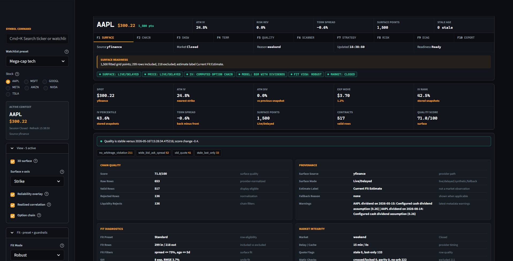
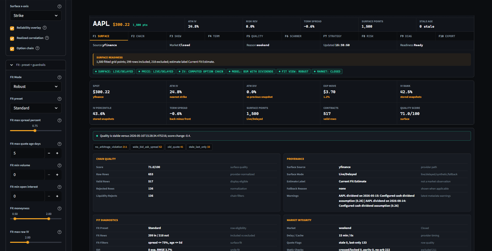
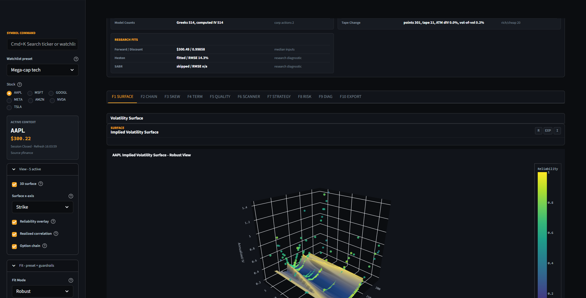
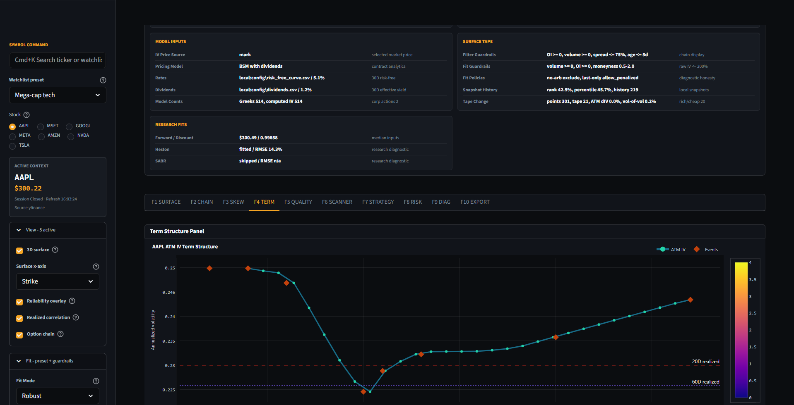

# Real-Time Options Volatility Surface

A Python toolkit for computing and visualizing implied-volatility surfaces for
US equity options. The dashboard now behaves as a compact quant workstation:
it shows data provenance, distinguishes live/delayed data from synthetic
fallbacks, builds surfaces from real `yfinance` option chains when available,
and exposes chain quality diagnostics beside the charts.

## Project Direction

This repo is now the base for a larger financial intelligence platform. The
existing volatility workstation remains the market-context layer, while the new
RAG track will ingest SEC filings, 8-K exhibits, and earnings-call-adjacent
content to answer analyst-grade questions with validated citations. The full
scope and phased implementation plan live in
[docs/financial-rag-platform-plan.md](docs/financial-rag-platform-plan.md).

## Features

- Black-Scholes pricing and Greeks: delta, gamma, theta, vega, rho.
- Implied-volatility solver with Newton-Raphson, bisection, and Brent paths.
- Volatility surface construction across strikes and expiries.
- Streamlit workstation with Surface, Chain, Skew & Term, Risk, and Diagnostics tabs.
- Real yfinance option-chain normalization with source, cache, and rejection metadata.
- Explicit synthetic/fallback labeling when live or delayed data is unavailable.
- Realized return correlations from historical yfinance closes.
- Built-in caching to be friendlier to yfinance rate limits.

## Supported Tickers

Common defaults include `AAPL`, `MSFT`, `GOOGL`, `NVDA`, `TSLA`, `SPY`,
`QQQ`, `META`, `AMZN`, and `JPM`. The dashboard sidebar includes a larger
equity and ETF universe.

## Quick Start

```bash
git clone <this-repo>
cd Real-Time-Options-Volatility-Surface
python -m venv .venv
.venv\Scripts\activate
pip install -r requirements.txt
copy .env.example .env
```

For reproducible installs, use the pinned direct-dependency lock after creating
the virtual environment:

```bash
pip install -r requirements.lock
```

On macOS/Linux, activate with:

```bash
source .venv/bin/activate
```

Use the project virtual environment for tests and dashboard work. Some base
Anaconda environments can carry incompatible global web-stack packages; this
project expects Streamlit's `starlette>=0.40.0` dependency set.

The `.env` file is optional for the default yfinance workflow. Paid API keys
are reserved for future provider integrations and the upcoming filings RAG
pipeline.

## Running

| Command | What it does |
| --- | --- |
| `streamlit run app.py` | Launches the interactive dashboard on port 8501. |
| `python main.py` | Runs a noninteractive smoke test and exits. |
| `python main.py --smoke-test` | Same as above, explicit CI-friendly smoke test. |
| `python main.py --interactive` | Opens the legacy interactive CLI prompt. |
| `python main.py test` | Runs the older full CLI system test, including data fetches. |
| `.\venv\Scripts\python.exe -m scripts.financial_rag_phase1_smoke` | Runs the Phase 1 SEC filings ingestion, parsing, chunking, and optional Voyage embedding smoke pipeline for NVDA. |
| `.\venv\Scripts\python.exe scripts\financial_rag_phase2_retrieval_smoke.py` | Runs the Phase 2 local dense retrieval smoke over cached chunks and Voyage vectors. |
| `.\venv\Scripts\python.exe scripts\financial_rag_phase3_query_smoke.py` | Runs the Phase 3 deterministic query-routing smoke over local retrieval. |
| `.\venv\Scripts\python.exe scripts\financial_rag_phase4_workbench_smoke.py` | Runs the Phase 4 local API/workbench smoke without SEC refetch. |
| `.\venv\Scripts\python.exe -m streamlit run scripts\financial_rag_phase4_workbench.py` | Launches the local filings evidence workbench. |
| `.\venv\Scripts\python.exe scripts\financial_rag_phase4_eval_report.py` | Writes the tiny offline Phase 4 retrieval eval report under ignored artifacts. |
| `.\venv\Scripts\python.exe scripts\financial_rag_phase5_differentiators_report.py` | Writes the Phase 5 local differentiators report under ignored artifacts. |
| `.\venv\Scripts\python.exe scripts\financial_rag_phase6_demo_workflow.py` | Runs the local Phase 6 recruiter-demo workflow and writes readiness/evidence reports under ignored artifacts. |
| `.\venv\Scripts\python.exe scripts\financial_rag_phase7_api_smoke.py` | Runs local Phase 7 API contract smoke checks and writes an ignored report artifact. |
| `.\venv\Scripts\python.exe scripts\financial_rag_phase7_api_server.py` | Launches the optional local FastAPI adapter when FastAPI is installed. |
| `.\venv\Scripts\python.exe scripts\financial_rag_openai_answer_smoke.py` | Dry-runs OpenAI answer readiness over local evidence without calling OpenAI. Add `--live` to test with `OPENAI_API_KEY`. |
| `.\venv\Scripts\python.exe scripts\financial_rag_expanded_retrieval_eval.py` | Runs expanded offline retrieval-quality evals across multi-company fixtures. |
| `.\venv\Scripts\python.exe scripts\financial_rag_expanded_answer_eval.py` | Runs expanded dry-run answer evals; add `--live` for opt-in OpenAI calls. |
| `.\venv\Scripts\python.exe scripts\financial_rag_retrieval_repair.py --tickers NVDA` | Rebuilds SEC-aware local RAG chunks from cached filings without SEC refetch; add `--fetch-sec` to expand the corpus and `--embed` to refresh Voyage vectors. |
| `python scripts/verify.py` | Runs lint, compile, pytest, and the dashboard healthcheck. |
| `python scripts/verify.py --fix` | Applies Ruff formatting/fixes, then runs verification. |
| `python -m scripts.healthcheck` | Runs project import, pricing, connector, surface, and Streamlit checks. |
| `python diagnostic.py` | Sanity-checks pricing, IV, Greeks, and surface construction. |

## Dashboard State

The first screen exposes provenance before analysis. Live/delayed data uses the
market provider path; synthetic and fallback states are labeled in the header
and Diagnostics tab so generated data is never presented as live.


## Dashboard Preview

The workstation-style UI combines ticker selection, data provenance, surface
quality, and fit diagnostics in one view.



The diagnostics panels show provider provenance, quote quality, model inputs,
market-integrity checks, and fit guardrails for the current chain.



The surface view renders the fitted implied-volatility surface with quote
reliability overlays.



The term-structure panel compares ATM implied volatility across expiries and
marks nearby events against realized-volatility references.



## Project Layout

```text
.
|-- app.py                  # Streamlit dashboard entry point
|-- main.py                 # CLI smoke test, monitoring, and legacy prompt
|-- dashboard_connector.py  # Data/provenance orchestration for the dashboard
|-- config.py               # Shared configuration
|-- requirements.lock       # Pinned direct dependency set
|-- config/
|   `-- financial_rag_universe.yaml # Initial 20-company filings universe
|-- docs/                   # Architecture notes and dashboard screenshots
|-- src/
|   |-- data/               # yfinance price/options providers and synthetic fallback
|   |-- financial_rag/      # Filings RAG scaffolding and future pipeline modules
|   |-- pricing/            # Black-Scholes and implied-vol solver
|   |-- analysis/           # Volatility surface construction
|   |-- visualization/      # Plotly and matplotlib helpers
|   |-- portfolio/          # Portfolio analytics scaffolding
|   |-- realtime/           # Streaming/refresh scaffolding
|   |-- utils/              # Shared helpers
|   `-- config/             # Per-asset configuration
|-- tests/                  # pytest unit tests
|-- scripts/                # CLI utilities and healthcheck
`-- plots/                  # Generated surface images
```

## Testing

```bash
pytest tests/
python -m scripts.healthcheck
python scripts/verify.py
```

On Windows, prefer the repo virtual environment explicitly when in doubt. In a
fresh checkout this is usually `.venv`; this local workspace currently uses
`venv`.

```bash
.\.venv\Scripts\python.exe -m pytest -q
.\.venv\Scripts\python.exe -m scripts.healthcheck
```

Substitute `.\venv\Scripts\python.exe` if using this existing local workspace.

Pytest discovery is scoped to `tests/` by `pytest.ini`; legacy runnable demos in
`scripts/` remain import/compile checked without being collected as unit tests.
Tests cover Black-Scholes pricing, put-call parity, Greeks signs/bounds,
price-to-IV round trips, option-chain cleaning, provider contracts, config
round trips, provenance labels, and deterministic Streamlit AppTest states.

## Architecture And Glossary

The data path is documented in [docs/architecture.md](docs/architecture.md):
providers -> normalized canonical models -> quant engine -> connector ->
dashboard, with offline tests attached to the normalized and rendered states.
The Phase 1 filings smoke pipeline is documented in
[docs/financial-rag-phase1-smoke.md](docs/financial-rag-phase1-smoke.md).
The Phase 2 local retrieval smoke is documented in
[docs/financial-rag-phase2-retrieval.md](docs/financial-rag-phase2-retrieval.md).
The Phase 6 recruiter-demo workflow is documented in
[docs/financial-rag-phase6-demo-guide.md](docs/financial-rag-phase6-demo-guide.md).
The Phase 7 local API contract is documented in
[docs/financial-rag-phase7-api-guide.md](docs/financial-rag-phase7-api-guide.md).
OpenAI API-key testing is documented in
[docs/financial-rag-openai-testing.md](docs/financial-rag-openai-testing.md).
Expanded retrieval and answer testing is documented in
[docs/financial-rag-testing-expansion.md](docs/financial-rag-testing-expansion.md).
The current local retrieval/answer eval baseline (commands, metrics, coverage,
and known gaps) is recorded in
[docs/financial-rag-eval-baseline.md](docs/financial-rag-eval-baseline.md).
Retrieval repair, reingestion behavior, and gold-label maintenance are
documented in
[docs/financial-rag-retrieval-repair.md](docs/financial-rag-retrieval-repair.md).
Reviewer-facing definitions for IV, DTE, moneyness, skew, risk reversal,
butterfly, IV rank, SVI, and data provenance modes live in
[docs/glossary.md](docs/glossary.md).
Surface-fit quality, recommended fit presets, validation diagnostics, and the
distinction between raw quotes and fitted estimates are covered in
[docs/surface_quality.md](docs/surface_quality.md).

## Data Honesty

The dashboard intentionally labels each view as live/delayed, synthetic, or
fallback. yfinance data may be delayed, incomplete, rate-limited, or unavailable
for some symbols. When real option chains cannot be fetched or normalized, the
surface can fall back to a Black-Scholes-consistent synthetic chain, and the UI
shows that fallback reason in the data-quality row and Diagnostics tab.

## Disclaimer

This project is for research and educational use. It is not investment advice
and is not built for live trading.
