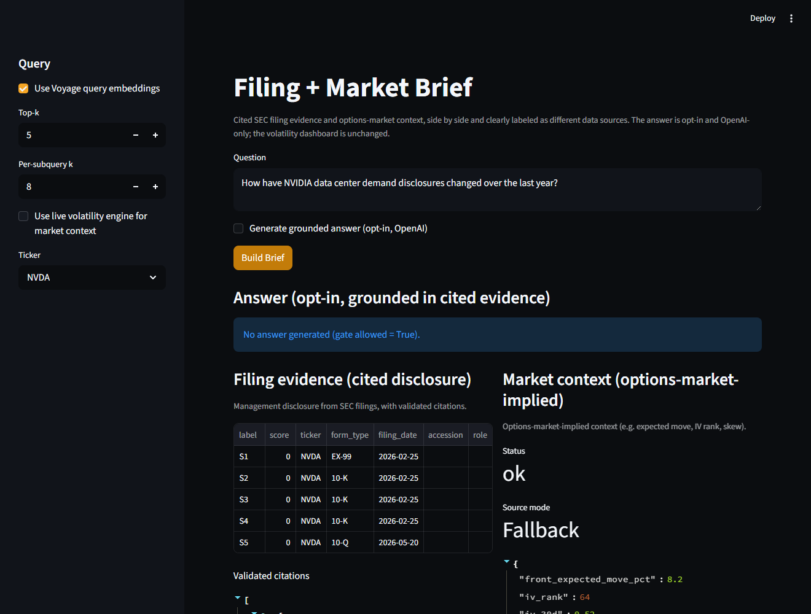

# Financial Filing Market Intelligence

A point-in-time SEC-filings research platform: ask an analyst question and get an
answer grounded in 10-K / 10-Q / 8-K / EX-99 disclosure with **validated inline
citations**, paired with a clearly-labeled options-market context panel. It is
built on idempotent SEC ingestion, section-aware chunking, hybrid retrieval,
citation-validated synthesis, and honest coverage reporting.

The defining principle is **data honesty**: retrieved, model-derived, and
market-implied values are never presented as something they are not. Filing
evidence (management disclosure, cited) and market context (options-market
implied) stay in separate, provenance-labeled blocks and are never merged into a
single claim.

## Why it's interesting

- **Citation discipline** — every factual answer maps to a retrieved chunk; the
  validator rejects hallucinated citation labels and fails closed.
- **Messy real-world ingestion** — SEC EDGAR filings parsed into sections,
  exhibits, and speaker turns, with uneven EX-99 / CFO-commentary coverage
  surfaced honestly rather than hidden.
- **A real eval harness** — retrieval and answer quality are measured (Recall@k,
  MRR, NDCG@k, section/source hit rate, citation validity), not just asserted.
- **Separation of sources** — cited filing disclosure and options-market context
  carry explicit, distinct provenance labels; the market panel is offline-safe
  and labels itself unavailable when no snapshot is supplied.
- **Measured, not bolted-on** — features that didn't earn their place (e.g. a
  reranker) ship as clearly-labeled opt-in infrastructure, not the default.

## Demo

The unified brief — a cited filing answer beside an options-market context panel,
each labeled as a distinct data source, with an opt-in citation-validated answer:



The filings corpus is local-only (not committed). Build a small demo corpus once
— a free SEC fetch; **no paid keys required** (set `SEC_USER_AGENT` in `.env`;
Voyage embeddings are optional, lexical retrieval works without them):

```bash
.\venv\Scripts\python.exe scripts\financial_rag_retrieval_repair.py --tickers NVDA --fetch-sec
```

Then:

```bash
# Unified brief: cited filing answer + options-market context (one screen)
.\venv\Scripts\python.exe -m streamlit run scripts\financial_rag_brief_view.py

# Headless version (writes a JSON brief, no UI)
.\venv\Scripts\python.exe scripts\financial_rag_brief_smoke.py
```

Add `--embed` to the corpus command (with `VOYAGE_API_KEY`) for dense retrieval,
and `--answer` to the brief smoke (with `OPENAI_API_KEY`) for the opt-in
generated answer. Market context defaults to a deterministic offline snapshot; it
is attached through an injectable provider so the platform never depends on a live
market feed.

## Eval results

Local retrieval/answer eval over a 12-ticker SEC corpus (~6,259 chunks), offline
lexical retrieval. Numbers are regenerated locally (last refreshed 2026-07-31);
see [docs/financial-rag-eval-baseline.md](docs/financial-rag-eval-baseline.md) for
the dated history and coverage notes.

| Metric | Value |
| --- | --- |
| Eval cases / gold labels resolved | 50 / 58 |
| Section/source hit rate | 0.860 |
| Gold Recall@5 | 0.667 |
| Gold MRR | 0.421 |
| Answer citation validity | 1.000 (0 hallucinated, 0 uncited) |

```bash
.\venv\Scripts\python.exe scripts\financial_rag_expanded_retrieval_eval.py --top-k 5 --per-subquery-k 8
.\venv\Scripts\python.exe scripts\financial_rag_expanded_answer_eval.py --top-k 5 --per-subquery-k 8
```

## Quick start

```bash
python -m venv venv
.\venv\Scripts\activate
pip install -r requirements.txt   # or requirements.lock for pinned installs
copy .env.example .env            # optional; needed only for SEC fetch / Voyage / OpenAI
```

The default workflows are cache-only and run offline. SEC ingestion (Voyage
embeddings optional) is opt-in:

```bash
.\venv\Scripts\python.exe scripts\financial_rag_retrieval_repair.py --tickers NVDA --fetch-sec --embed
```

## Key commands

| Command | What it does |
| --- | --- |
| `streamlit run scripts\financial_rag_brief_view.py` | Unified brief: cited filing evidence + market context. |
| `python scripts\financial_rag_brief_smoke.py` | Headless brief (writes a JSON artifact, no UI). |
| `python scripts\financial_rag_expanded_retrieval_eval.py` | Retrieval-quality eval (Recall@k, MRR, NDCG@k). |
| `python scripts\financial_rag_retrieval_repair.py --fetch-sec --embed` | Build/refresh the local SEC corpus and Voyage vectors. |
| `python scripts\financial_rag_api_server.py` | Optional local FastAPI adapter over the cache-only RAG service. |
| `python scripts\verify.py` | Lint, compile, full pytest suite, and the RAG brief healthcheck. |

## Architecture

```text
src/
|-- financial_rag/        # SEC ingestion, parsing, chunking, retrieval, query,
|   |                     #   synthesis (citations), evaluation, audit, API,
|   |                     #   differentiators, and the market-context integration
|-- marketdata/           # self-contained realized-volatility estimators
`-- utils/                # structured logging + timing helpers
```

The RAG-plus-market integration is documented in
[docs/financial-rag-market-context.md](docs/financial-rag-market-context.md); the
dated eval history and coverage notes are in
[docs/financial-rag-eval-baseline.md](docs/financial-rag-eval-baseline.md).

Market context attaches through an injectable provider seam
(`market_provider_from_metrics`), so the RAG package has no dependency on any live
market or volatility stack. When no snapshot is supplied, the market block is
labeled `unavailable` and the path stays fully offline.

## Honest limitations

- EX-99 / CFO-commentary coverage is uneven by issuer; coverage reports expose
  this rather than hiding it. Some tickers have primary filings only.
- INTC chunks lack item-number metadata (its 10-K labels live only in a trailing
  index), so item-filtered INTC queries return empty; non-item topics resolve.
- A rerank stage exists but ships **opt-in, off by default**: it does not beat the
  domain-tuned first stage on the current eval, partly because the gold labels are
  resolved by that same scorer. The honest write-up is in the eval-baseline note.
- Market context is a deterministic offline snapshot by default; a live provider
  is not part of this build. The market block is always source-labeled.

## Testing

```bash
.\venv\Scripts\python.exe -m pytest -q
.\venv\Scripts\python.exe scripts\verify.py
```

Tests cover SEC parsing and chunking, retrieval and citation validation, eval
metrics, API contracts, the realized-volatility estimators, and the unified
filing + market brief.

## Disclaimer

For research and educational use. Not investment advice and not built for live
trading.
