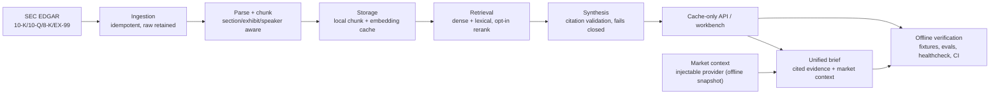

# Architecture

A point-in-time SEC-filings research platform. SEC disclosure becomes cited,
retrievable evidence; each analyst question is answered from that evidence and
paired with a clearly-labeled options-market context panel. One discipline runs
through it: every value carries its source and mode, and retrieved,
model-derived, or market-implied values are never presented as live market
observations. Filing evidence (management disclosure, cited) and market context
(options-market implied) stay in separate, provenance-labeled blocks.

## Filings-intelligence pipeline

SEC EDGAR is the citation backbone. Ingestion is idempotent and retains the raw
payloads; parsing splits filings into sections, exhibits, and speaker turns;
chunking is section/exhibit/speaker aware. Chunks and their embeddings are held in
a local cache, so the default retrieval and brief paths run offline with no
network. Retrieval is dense + lexical fusion with an opt-in rerank stage, and
synthesis validates every inline citation against a retrieved chunk, failing
closed on hallucinated labels. A cache-only service (`src/financial_rag/api`,
with the `workbench` helpers) exposes retrieval, coverage, and document access;
evaluation (`src/financial_rag/evaluation`) measures retrieval and answer quality
against gold labels.

The package is organized into focused subpackages under `src/financial_rag/`:
`ingestion`, `parsing`, `chunking`, `storage`, `embeddings`, `retrieval`,
`synthesis`, `query`, `api`, `evaluation`, `audit`, `differentiators`, and
`integration`.

## Market context

Market context attaches through an **injectable provider** seam
(`market_provider_from_metrics` in `src/financial_rag/integration`), so the RAG
package has no dependency on any live market or volatility stack. The default path
supplies a deterministic offline snapshot; when no snapshot is supplied, the
market block is labeled `unavailable` and the path stays fully offline. A live
provider is not part of this build — `volatility_market_provider` raises, and the
existing `get_market_context` handler catches it and labels the context
`unavailable`. Self-contained realized-volatility estimators live separately in
`src/marketdata/realized_vol.py` (numpy/pandas only, no external market feed).

## The unified brief

The brief (`src/financial_rag/integration`) pairs cited filing evidence with an
options-market context panel for one question and ticker. The two are deliberately
decoupled and never merged into a single claim: disclosure, market data, and any
generated answer are each explicitly labeled as distinct sources. The generated
answer is opt-in — it runs only when both an evidence/readiness gate allows it and
an OpenAI key is present; otherwise the brief returns cited evidence plus a labeled
market block with no answer.

## Provenance contract

Every retrieval result carries ticker, form type, accession number, filing date,
section, and source URL, and every answer citation maps to a retrieved chunk. The
market block carries its status (`ok` / `unavailable`), source mode, and metrics.
Model-derived and market-implied values stay explicitly labeled — a reader can
always tell management disclosure from what the options market is implying.

## Offline contract

The default paths are cache-only and deterministic. Tests use in-memory fixtures
and gold-label evals; the healthcheck (`scripts/healthcheck.py`) builds an
in-memory RAG service and runs the full retrieval → citation → brief-assembly path
with no fetched corpus, so CI is green on a fresh clone with no network. Optional
SEC fetch, Voyage embeddings, and OpenAI answers can be absent or fail, and the
system still renders a labeled offline or lexical-retrieval state.

See [financial-rag-market-context.md](financial-rag-market-context.md) for the
integration detail and [financial-rag-eval-baseline.md](financial-rag-eval-baseline.md)
for the dated eval history.
