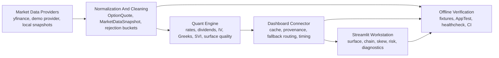

# Architecture

The dashboard is organized around a provenance-preserving data path. Providers
produce raw market inputs, normalization converts them into canonical models,
the quant layer enriches and fits those models, and the Streamlit workstation
renders both analytics and quality metadata.

## Provenance Contract

Every provider response carries source, mode, timestamp, cache age, fallback
reason, and row-count metadata. Synthetic and fallback paths remain explicit so
analytics can be rendered without pretending delayed or generated data is live.

## Offline Contract

Tests use deterministic fixtures and AppTest fallback modes. CI does not require
network data for the dashboard smoke path; live providers can fail and the app
must still render a labeled fallback state.
