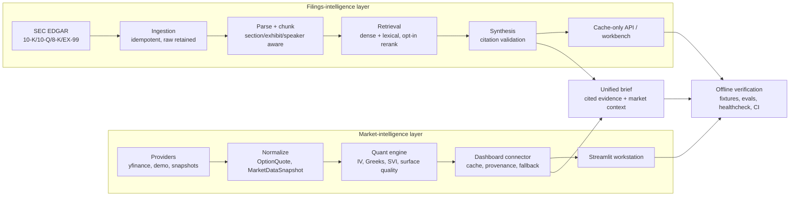

# Architecture

This is one platform with two provenance-preserving layers that meet in a unified
brief. A **market-intelligence layer** turns option chains into implied-volatility
analytics, and a **filings-intelligence layer** turns SEC disclosure into cited,
retrievable evidence. A shared discipline runs through both: every value carries
its source and mode, and fitted, fallback, synthetic, retrieved, or
model-derived values are never presented as live market observations.

## Market-intelligence layer

Providers produce raw market inputs; normalization converts them into canonical
`OptionQuote` / `MarketDataSnapshot` models with rejection buckets; the quant
engine fits rates, dividends, IV, Greeks, SVI, and surface quality; and the
dashboard connector caches results and routes fallbacks while preserving timing
and provenance. The Streamlit workstation renders analytics beside their quality
metadata.

## Filings-intelligence layer

SEC EDGAR is the citation backbone. Ingestion is idempotent and retains the raw
payloads; parsing splits filings into sections, exhibits, and speaker turns;
chunking is section/exhibit/speaker aware. Retrieval is dense + lexical fusion
(with an opt-in rerank stage), and synthesis validates every inline citation
against a retrieved chunk, failing closed on hallucinated labels. A cache-only
service exposes retrieval, coverage, documents, and market-context endpoints.

## The integration

The two layers meet in `src/financial_rag/integration`: the unified brief pairs
cited filing evidence with an options-market context panel for one question and
ticker. They are deliberately decoupled — the filings package depends on the
volatility engine only through an injectable provider, and the brief keeps
disclosure, market data, and any generated answer explicitly labeled as distinct
sources.

## Provenance contract

Every market response carries source, mode, timestamp, cache age, fallback
reason, and row counts. Every retrieval result carries ticker, form type,
accession, filing date, section, and source URL, and every answer citation maps
to a retrieved chunk. Synthetic, fallback, fitted, and model-derived values stay
explicitly labeled.

## Offline contract

The default paths are cache-only and deterministic. Tests use fixtures, AppTest
fallback modes, and gold-label evals; CI requires no network. Live providers (and
optional Voyage/OpenAI calls) can be absent or fail, and the system still renders
a labeled fallback or lexical-retrieval state.
