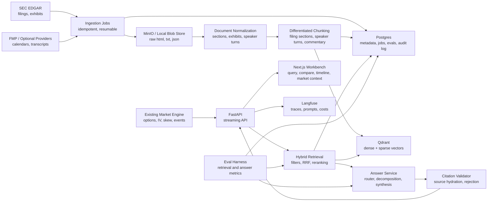

# Financial Volatility And Filings Intelligence Platform

## Executive Summary

This repository should evolve from a real-time options volatility workstation into a broader financial intelligence platform. The existing volatility surface project remains valuable: it already demonstrates market-data normalization, provenance labels, fallback honesty, quantitative analytics, and a polished Streamlit dashboard. The new RAG system should build beside it, then eventually connect to it, so the final project answers both:

- What is the market implying through options, skew, term structure, and expected moves?
- What is management and SEC disclosure saying in filings, exhibits, and earnings materials?

The combined project is stronger than either project alone. A recruiter sees quantitative engineering, messy external data ingestion, production RAG, citation discipline, background jobs, observability, evaluation, and a coherent domain story: LLM-powered tools that make expert financial content legible without hiding data quality.

The target user is a junior hedge fund analyst, equity research associate, or applied AI interviewer who wants verifiable answers over public-company disclosure and wants to compare those answers with market-implied volatility context.

## How The Existing Project Fits

The current codebase should not be thrown away. It becomes the market-intelligence side of the platform.

Existing strengths to preserve:

- `src/data`: provider contracts, retry behavior, normalized option-chain models, snapshots, and source metadata.
- `src/quant`, `src/pricing`, and `src/analysis`: volatility, rates, dividends, Greeks, SVI, surface validation, quote quality, and expected-move logic.
- `dashboard_connector.py` and `src/dashboard`: a provenance-preserving UI layer that already treats live, delayed, fallback, and synthetic data honestly.
- `scripts/verify.py`, `tests/`, and the docs: a real verification habit, which should expand into RAG retrieval and answer evals.

New RAG work should live in a separate namespace first, then integrate through explicit interfaces:

- `src/financial_rag`: SEC/transcript-provider ingestion, document normalization, chunking, retrieval, reranking, answer synthesis, citations, and eval.
- `config/financial_rag_universe.yaml`: the initial 20-company universe.
- `docs/financial-rag-platform-plan.md`: this implementation contract for Codex, Claude Code, and future contributors.
- Future `backend/` and `frontend/` folders when the app moves from Streamlit-only to FastAPI plus Next.js.

The integration point is a shared concept of provenance. Market snapshots have source, mode, timestamp, fallback reason, and quality metadata. RAG chunks should have equivalent citation metadata: source URL, accession number, exhibit, fiscal period, document type, section path, speaker, retrieval score, and citation validation status.

## Product Scope

### Core User Workflows

1. Ask a filing question and receive an answer with inline citations:
   - Example: "What were NVIDIA's stated risks in the latest 10-K?"
2. Ask temporal questions over multiple quarters:
   - Example: "How has NVIDIA's gross margin commentary changed over the last 8 quarters?"
3. Compare SEC filings with earnings-call-adjacent material:
   - Example: "Does the latest 10-Q risk factor language match the CFO commentary?"
4. Compare companies:
   - Example: "Compare data center revenue commentary from NVDA, AMD, and INTC last quarter."
5. Filter by speaker or role when transcripts, prepared remarks, or CFO commentary are available:
   - Example: "What has the CFO said about capital allocation in the last year?"
6. Bring in market context from the existing options engine:
   - Example: "Management says demand is accelerating. How did implied volatility and skew behave around the same period?"

### Data Coverage

Version 1 should target 20 tickers across 6 sectors, with 8 quarters of history each.

Initial universe:

| Sector | Tickers |
| --- | --- |
| Technology | NVDA, MSFT, AAPL, AMD, INTC, GOOGL |
| Communication / Internet | META, AMZN |
| Finance | JPM, BAC, GS |
| Consumer | WMT, COST, MCD |
| Healthcare | UNH, JNJ, LLY |
| Energy / Industrial | XOM, CVX, CAT |

Expected scale:

- Around 320 primary documents before exhibits.
- Around 50K to 100K chunks after section-aware and speaker-aware chunking.
- Local development should support a one-ticker smoke corpus before scaling to all 20 tickers.

### Data Sources

Use [financial-rag-data-source-research.md](financial-rag-data-source-research.md)
as the current source-selection note before implementing ingestion. The short
version: SEC EDGAR should be the free filing backbone, Alpha Vantage is the
first free transcript candidate to test, EarningsAPI is the first low-cost paid
transcript option, and Quartr is the best enterprise-quality long-term option.

Required for v1:

- SEC EDGAR API:
  - Company submissions.
  - 10-K, 10-Q, 8-K filings.
  - EX-99 exhibits where available.
  - Primary citation source.
- Voyage AI:
  - Dense embeddings.
  - Optional reranking if quality and cost beat a local/open cross-encoder.
- OpenAI API:
  - Query routing.
  - Query decomposition.
  - Answer synthesis.
  - Citation-aware generation.
  - Optional HyDE, classification, and answer evaluation.
  - Use only after the retrieval core is proven; OpenAI is intentionally not
    called during the Phase 1 ingestion-to-embedding smoke pipeline.
- yfinance and current options code:
  - Existing market and options analytics.
  - Used for market context, not as filing evidence.

Optional in v1:

- FMP free tier:
  - CIK lookup, fiscal calendars, possibly transcripts depending on Phase 0 tests.
  - Do not make the v1 core dependent on paid FMP.

Deferred:

- Full earnings-call Q&A transcripts through FMP Ultimate, Quartr, or another provider.
- XBRL numerical verification.
- Contradiction detection.
- Automated "what changed" redlines.

### OpenAI Model Routing Plan

OpenAI models should be selected by task and cost, not by always choosing the
largest available model. At implementation time, verify current model names in
the official OpenAI API docs and update defaults deliberately. As of the current
planning notes, there is no project dependency on a `gpt-5.5` model name.

Recommended future split:

| Task | Planned default | Notes |
| --- | --- | --- |
| Query routing and classification | `gpt-5 nano` or `gpt-5 mini` | Prefer the smallest model that reliably extracts tickers, periods, filing types, sections, and query type. |
| Query decomposition | `gpt-5 mini` | Used for temporal and cross-company subquery planning after metadata filters are available. |
| HyDE or synthetic retrieval hints | `gpt-5 mini` | Optional and eval-gated; do not add before baseline retrieval metrics exist. |
| Citation-aware answer synthesis | `gpt-5.2` | Use only after retrieval and citation validation are strong enough to constrain the answer. |
| High-value synthesis or audit passes | `gpt-5.2 pro` only if needed | Reserve for difficult analyst briefs or eval audits where quality lift justifies cost. |
| Cheap answer/eval classification | `gpt-5 mini` | Use cached outputs and batch runs where practical. |
| Embeddings | Voyage AI | Keep dense embeddings on Voyage for this architecture unless a future eval explicitly compares providers. |

The default production posture should be `gpt-5 mini` for orchestration and
`gpt-5.2` for final high-value synthesis. This keeps the system cost-conscious
and demonstrates production judgment. Larger or newer flagship models should be
introduced only behind configuration, with cost tracing and eval evidence that
they improve citation faithfulness, completeness, or analyst usefulness.

## Important Transcript Nuance

In v1, "transcripts" should be described precisely. SEC 8-K exhibits usually do not provide complete earnings-call transcripts. They provide a mix of:

- Press releases.
- CFO commentary.
- Prepared remarks.
- Occasional scripts with speaker labels.
- Rare full transcripts.

This unevenness is a design constraint, not a failure. The system should ingest whatever disclosure each company provides, classify it honestly, and expose coverage gaps in metadata and UI. Interview framing: the project handles real disclosure variation gracefully, then has a clean Phase 5 upgrade path for paid transcript depth.

## Target Architecture



## Repository Layout Target

Keep the current Streamlit app working while the new system grows.

```text
.
|-- app.py                         # Existing Streamlit volatility workstation
|-- dashboard_connector.py          # Existing market dashboard orchestration
|-- backend/                        # Phase 1+ FastAPI app
|   |-- app/
|   `-- tests/
|-- frontend/                       # Phase 4 Next.js app
|-- config/
|   |-- financial_rag_universe.yaml # Initial ticker universe
|   `-- ...
|-- docs/
|   |-- financial-rag-platform-plan.md
|   |-- architecture.md
|   `-- ...
|-- src/
|   |-- financial_rag/              # New RAG domain package
|   |   |-- ingestion/
|   |   |-- parsing/
|   |   |-- chunking/
|   |   |-- retrieval/
|   |   |-- synthesis/
|   |   |-- evaluation/
|   |   `-- observability/
|   |-- data/                       # Existing market data package
|   |-- quant/                      # Existing options analytics
|   `-- dashboard/                  # Existing Streamlit UI package
|-- tests/
|   |-- financial_rag/
|   `-- ...
|-- docker-compose.yml              # Phase 1+ local services
|-- requirements.txt                # Existing app dependencies
`-- requirements-rag.txt            # Phase 1+ RAG/backend dependencies
```

## Core Data Model

### FilingDocument

Minimum fields:

- `document_id`: stable internal ID.
- `ticker`.
- `cik`.
- `company_name`.
- `accession_number`.
- `filing_date`.
- `period_end_date`.
- `fiscal_year`.
- `fiscal_period`.
- `form_type`: `10-K`, `10-Q`, `8-K`, `EX-99`, `TRANSCRIPT`, `PRESS_RELEASE`, `CFO_COMMENTARY`.
- `source_url`.
- `local_blob_uri`.
- `content_hash`.
- `ingested_at`.
- `parser_version`.

### DocumentChunk

Minimum fields:

- `chunk_id`.
- `document_id`.
- `ticker`.
- `form_type`.
- `fiscal_year`.
- `fiscal_period`.
- `section_path`.
- `item_number`.
- `speaker_name`.
- `speaker_role`.
- `chunk_text`.
- `parent_text`.
- `token_count`.
- `start_offset`.
- `end_offset`.
- `source_url`.
- `citation_label`.
- `embedding_model`.
- `sparse_model`.
- `created_at`.

### RetrievalResult

Minimum fields:

- `chunk_id`.
- `rank`.
- `dense_score`.
- `sparse_score`.
- `rrf_score`.
- `rerank_score`.
- `metadata`.
- `citation_label`.
- `source_url`.
- `source_excerpt`.

### Answer

Minimum fields:

- `answer_text`.
- `query_type`.
- `filters`.
- `sub_queries`.
- `citations`.
- `rejected_citations`.
- `retrieval_trace_id`.
- `model`.
- `latency_ms`.
- `cost_estimate`.

## Retrieval Design

### Query Router

Classify each user query as one or more query types:

- `single_doc_lookup`.
- `temporal`.
- `cross_source`.
- `cross_company`.
- `speaker_specific`.
- `market_context`.

The router must extract structured filters:

- Tickers.
- Company names.
- Time windows.
- Fiscal periods.
- Filing types.
- Sections.
- Speakers or roles.
- Metrics or business segments.

For temporal and cross-company questions, decompose into subqueries before retrieval. For example, "last 8 quarters" becomes one subquery per quarter, then a synthesis pass compares the evidence.

### Chunking

Chunking is the highest-quality lever.

Rules:

- 10-K and 10-Q: section-aware. Do not split across SEC Item boundaries.
- 8-K: item-aware, then exhibit-aware.
- EX-99 press releases: section-aware by heading.
- CFO commentary: section-aware by heading, preserving the document's narrative flow.
- Prepared remarks and transcripts: speaker-aware. One speaker turn can be one chunk; long speaker turns can split by paragraph under the same speaker metadata.
- Parent-document retrieval: embed precise chunks, then pass larger parent context to synthesis.

### Hybrid Retrieval

Use:

- Dense embeddings through Voyage AI.
- Sparse vectors through SPLADE or a BM25 fallback during early phases.
- Metadata prefilters.
- Reciprocal Rank Fusion.
- Reranking from top 50 to top 8, using Voyage rerank if it wins the eval/cost tradeoff or a local/open cross-encoder if not.

Do not skip reranking in the demo-quality path. It is one of the clearest signals that this is production RAG, not a tutorial.

### Citation Validation

Every inline citation must map to a retrieved chunk. The validator should:

- Parse citation markers from the generated answer.
- Confirm each citation ID exists in the retrieval set.
- Reject hallucinated citation labels.
- Hydrate citations into source URLs and document metadata.
- Fail closed when citations are missing for factual claims.

## API Contract

Initial FastAPI endpoints:

- `GET /health`
- `GET /companies`
- `POST /ingestion/sec/sync`
- `GET /ingestion/jobs/{job_id}`
- `POST /query`
- `POST /query/stream`
- `POST /compare`
- `GET /documents`
- `GET /documents/{document_id}`
- `GET /chunks/{chunk_id}`
- `POST /eval/retrieval`
- `POST /eval/answers`
- `GET /market-context/{ticker}`

`POST /query` request:

```json
{
  "question": "How has NVIDIA's gross margin commentary changed over the last 8 quarters?",
  "tickers": ["NVDA"],
  "time_window": "last_8_quarters",
  "include_market_context": true,
  "answer_style": "analyst_brief"
}
```

`POST /query` response:

```json
{
  "answer": "NVIDIA's gross margin commentary shifted from supply and mix constraints toward data center scale and product mix benefits [S1][S3].",
  "query_type": "temporal",
  "citations": [
    {
      "id": "S1",
      "ticker": "NVDA",
      "form_type": "10-Q",
      "fiscal_period": "FY2025 Q2",
      "section_path": "Management Commentary > Gross Margin",
      "url": "https://www.sec.gov/Archives/...",
      "excerpt": "..."
    }
  ],
  "market_context": {
    "ticker": "NVDA",
    "front_expected_move_pct": 8.2,
    "iv_rank": 64.0,
    "source_mode": "Delayed"
  },
  "trace_id": "..."
}
```

## Evaluation Plan

Do not leave eval for the end. Build it as soon as retrieval works.

### Retrieval Eval

Create `eval/retrieval_queries.csv` with at least 50 labeled questions.

Fields:

- `query_id`.
- `question`.
- `query_type`.
- `expected_tickers`.
- `expected_form_types`.
- `expected_periods`.
- `relevant_chunk_ids`.
- `notes`.

Metrics:

- Recall@5.
- Recall@10.
- MRR.
- NDCG@10.
- Reranker lift versus dense-only baseline.

### Answer Eval

Create `eval/answer_queries.csv` with at least 30 analyst-style questions.

Metrics:

- Citation validity.
- Faithfulness.
- Completeness.
- Unsupported claim count.
- Latency.
- Token cost.

Keep a CSV history per meaningful retrieval change. The README should eventually show an eval table with current numbers and baseline numbers.

## Implementation Phases

### Phase 0: Pre-Flight And Repo Preparation

Goal: determine data-source realities and prepare the repo without disrupting the current volatility dashboard.

Tasks:

- Add this project plan.
- Add `config/financial_rag_universe.yaml`.
- Add `.env.example` placeholders for SEC, Voyage, OpenAI, FMP, Postgres, Redis, Qdrant, MinIO, and Langfuse.
- Add ignored local storage paths for raw filings, parsed documents, vector cache, eval outputs, and object-store data.
- Create a small `src/financial_rag` namespace with typed constants and enums.
- Run existing tests to confirm the current volatility app still works.
- Manually curl or script-test:
  - SEC company submissions for NVDA.
  - SEC filing archive document download.
  - 8-K EX-99 coverage for NVDA, MSFT, AAPL, AMD, JPM.
  - Alpha Vantage transcript/free-tier behavior.

Done when:

- Existing tests still pass.
- The repo has a clear starting namespace for RAG.
- A short note is added to this document or a Phase 0 log with actual EX-99 and transcript-source findings.

### Phase 1: Foundation RAG

Goal: one ticker can be ingested and queried end to end with basic citations.

Tasks:

- Add `requirements-rag.txt` with FastAPI, Uvicorn, SQLAlchemy, Alembic, psycopg, Celery, Redis, Qdrant client, Voyage AI, OpenAI, BeautifulSoup/lxml, tiktoken, and eval utilities.
- Add Docker Compose for Postgres, Redis, Qdrant, MinIO, and Langfuse.
- Implement SEC client:
  - Respect SEC user-agent requirements.
  - Rate-limit requests.
  - Download company submissions.
  - Find 10-K, 10-Q, 8-K filings for one ticker.
- Implement raw blob storage abstraction:
  - Local filesystem first.
  - MinIO-compatible interface later.
- Implement basic document metadata tables.
- Implement naive HTML/text extraction.
- Implement naive token chunking with metadata.
- Generate Voyage embeddings.
- Store chunks in Qdrant.
- Add `POST /query` with dense-only retrieval and simple synthesis.
- Add basic citation labels that map to retrieved chunks.

Done when:

- `NVDA` latest 10-K can be ingested.
- A question like "What are NVIDIA's stated risks?" returns an answer with source labels.
- Citations map to real chunks.
- Existing volatility tests still pass.

### Phase 2: Real RAG Quality

Goal: move from "it answers" to demo-quality retrieval and citations.

Tasks:

- Implement SEC section parser:
  - 10-K and 10-Q Item boundaries.
  - 8-K Item boundaries.
  - EX-99 exhibit discovery and classification.
- Implement differentiated chunking:
  - Filing item chunks.
  - Exhibit heading chunks.
  - Speaker-turn chunks when labels exist.
- Add rich metadata filters.
- Add sparse retrieval:
  - SPLADE if practical.
  - BM25 fallback if SPLADE slows local development too much.
- Add Reciprocal Rank Fusion.
- Add reranker.
- Implement citation validator.
- Add streaming query endpoint.
- Add initial retrieval eval dataset with 15 to 20 questions.
- Trace query pipeline in Langfuse.

Done when:

- Dense-only, sparse-only, hybrid, and reranked results can be compared.
- Reranked hybrid retrieval is measurably better than dense-only on the initial eval set.
- The answer service rejects hallucinated citation IDs.

### Phase 3: Query Sophistication

Goal: all five RAG query types work across the initial universe.

Tasks:

- Implement query router.
- Implement temporal decomposition.
- Implement cross-company decomposition.
- Implement speaker and role filters.
- Add HyDE for abstract strategy questions.
- Add parent-document retrieval.
- Expand ingestion to all 20 tickers and 8 quarters.
- Add coverage reporting:
  - Which companies have CFO commentary.
  - Which have only press releases.
  - Which have prepared remarks.
  - Which have no usable EX-99 narrative.
- Add answer templates:
  - Analyst brief.
  - Timeline.
  - Compare table.
  - Source audit.

Done when:

- The system answers the five core query types.
- Missing or uneven transcript coverage is disclosed in the response metadata.
- The retrieval eval set reaches at least 50 labeled questions.

### Phase 4: Full Workbench UI, Eval, And Polish

Goal: recruiter-ready app.

Tasks:

- Add Next.js frontend.
- Build query view:
  - Streaming answer.
  - Citation drawer.
  - Retrieved evidence list.
  - Query trace metadata.
- Build compare view:
  - Company-by-company commentary comparison.
  - Period filters.
  - Exportable evidence table.
- Build timeline view:
  - Quarter-by-quarter commentary.
  - Optional volatility overlays from existing options engine.
- Build market context view:
  - Current implied-volatility surface snapshot.
  - Expected move.
  - Skew and term structure.
  - Provenance labels from the existing dashboard connector.
- Add eval dashboard or static eval report.
- Update README:
  - Demo GIF.
  - Architecture diagram.
  - Eval table.
  - Setup instructions.
  - Data-source limitations.
  - Interview talking points.
- Add CI workflow for lint, tests, and focused RAG eval smoke tests.

Done when:

- A reviewer can run the stack locally from README instructions.
- The UI demonstrates filing answers, citations, comparison, timeline, and market context.
- README front-loads value in the first screen.

### Phase 5: Differentiators

Goal: add features that make the project memorable after v1 is stable.

Options:

- Full Q&A transcript provider integration.
- Contradiction detection between filings and call commentary.
- XBRL numerical verification for claims involving revenue, margins, EPS, capex, or cash flow.
- "What changed?" diffs between sequential filings.
- Sentiment and uncertainty deltas over time.
- Market reaction studies around filing or earnings dates.
- Alerting when a new filing materially changes a tracked topic.

Done when:

- Each differentiator has an eval or verification story.
- The README clearly separates production-ready v1 from experimental stretch work.

## Coding Agent Workflow

Use this workflow when giving tasks to Codex or Claude Code:

1. Read this document and the current README.
2. Keep the existing volatility dashboard passing.
3. Work one phase task at a time.
4. Add or update tests in the same task.
5. Run the narrowest useful verification first, then the full verification before handoff.
6. Preserve provenance and citation metadata even in early prototypes.
7. Do not add agents, paid transcript dependencies, or large frontend rewrites before the retrieval core is proven.

Recommended task prompt format:

```text
Use docs/financial-rag-platform-plan.md. Implement Phase X / Task Y only.
Keep the current volatility app working. Add focused tests. Run the relevant
verification command and summarize what changed, what passed, and what remains.
```

## Engineering Guardrails

- Idempotent ingestion: rerunning a job should not duplicate documents or chunks.
- Raw source retention: store original SEC/FMP payloads before parsing.
- Parser versioning: every chunk should record the parser and chunker version.
- Citation-first answers: no factual answer without evidence.
- Explicit limitations: incomplete transcript coverage should be visible.
- Cost controls: cache embeddings and model outputs during local development.
- Small smoke corpus: every pipeline step should work on one ticker before all 20.
- No hidden fallbacks: reuse the current project's honesty about fallback and synthetic data.

## Near-Term File Checklist

Create or update these as implementation begins:

- `requirements-rag.txt`
- `docker-compose.yml`
- `src/financial_rag/ingestion/sec_client.py`
- `src/financial_rag/storage/blob_store.py`
- `src/financial_rag/parsing/sec_sections.py`
- `src/financial_rag/chunking/strategies.py`
- `src/financial_rag/retrieval/hybrid.py`
- `src/financial_rag/retrieval/rerank.py`
- `src/financial_rag/synthesis/citations.py`
- `src/financial_rag/evaluation/retrieval_eval.py`
- `backend/app/main.py`
- `frontend/`
- `tests/financial_rag/`

## Definition Of Recruiter-Ready

The project is recruiter-ready when:

- The app answers all five core RAG query types.
- Answers contain validated citations linked to source documents.
- The README shows current eval metrics, not just screenshots.
- The code demonstrates background jobs, observability, caching, and idempotent ingestion.
- The existing options volatility engine is integrated as market context.
- Known data limitations are stated clearly and handled gracefully.
